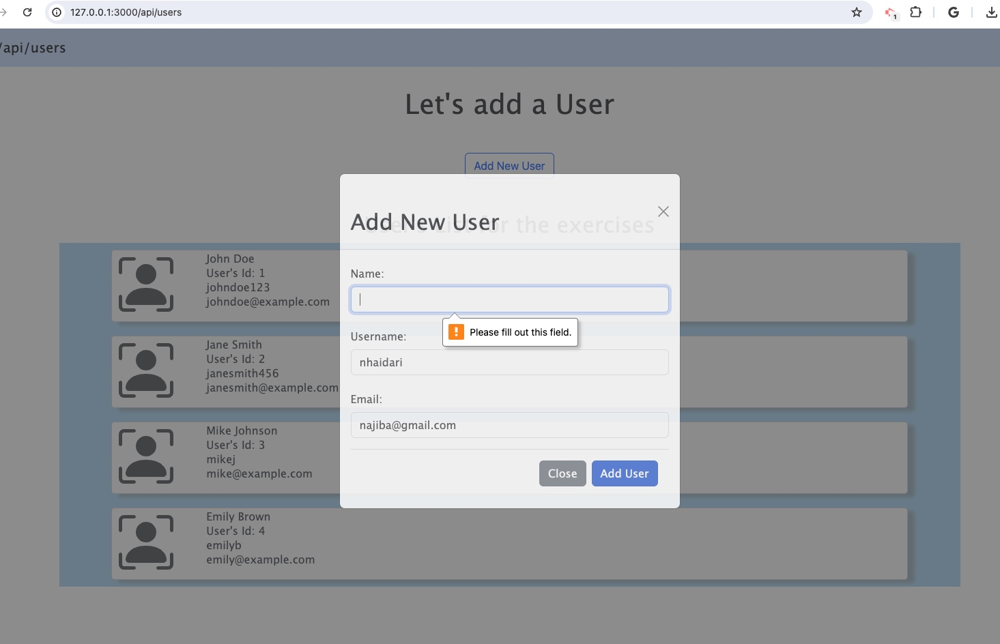
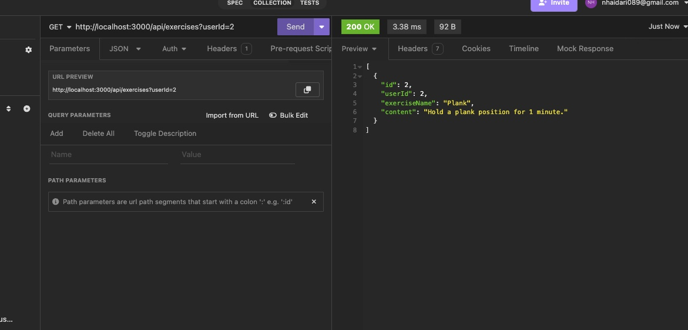

# express-server-application
Express Server Application

## Requirements for this SBA
- **Create and use custom middleware**: Define two or more middleware functions.
- **Create and use error-handling middleware**: Implement middleware for handling errors.
- **Utilize three different data categories**: Implement CRUD operations for each category.
- **Utilize reasonable data structuring practices**: Organize code in a structured and maintainable way.
- **Create GET, POST, PATCH/PUT, and DELETE routes**: Implement routes for each CRUD operation.
- **Include query parameters for data filtering**: Implement it to at least one route.
- **Adhere to REST principles**: Design API endpoints following RESTful conventions.
- **Create and render views using a template engine**: Set up a view template engine and create at least one view.
- **Include a form within a rendered view**: Create a form to allow interaction with the RESTful API.
- **Use simple CSS and Bootstrap** to style the rendered views.
- **Ensure that the program runs without errors**.
- **Inclue a README file** that contains a description of the application.

## Screenshot

  
  

## Table of Contents

- [Routes](#routes)
- [Technologies Used](#technologies-used)
- [Github Link](#github-link)
- [Installation](#installation)
- [License](#license)

## Routes
The application routes, please note that only GET/POST api/users have been used for front-end view by EJS template engine: 

* GET /
    * GET /api
        * GET /api/users
        * POST /api/users
            * GET /api/users/:id
            * PATCH /api/users/:id
            * DELETE /api/users/:id
        * GET api/exercises?userId=value (used query parameters)
        * GET /api/exercises
        * POST /api/exercises
            * GET /api/exercises/:id
            * PATCH /api/exercises/:id
            * DELETE /api/exercises/:id
        * GET api/instructions?userId=value (used query parameters)
        * GET /api/instructions
        * POST /api/instructions
            * GET /api/instructions/:id
            * PATCH /api/instructions/:id
            * DELETE /api/instructions/:id

## Technologies Used
- Javascript 
- Express.js
- RESTful API
- Node.js
- EJS Template Engine
- Bootstrap

## Github Link

- Github Repo URL: https://github.com/Najiba-Haidari/express-server-application

## Installation
- Fork the respository
- npm install
- Navigate to localhost:3000 and/or Insomnia/Postman

## License

This project is under the 

